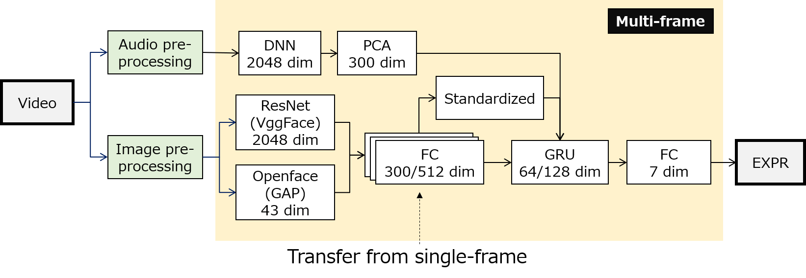

# Multi-modal Affect Analysis using standardized data within subjects in the Wild 

Challenges: **ICCV 2021: 2nd Workshop and Competition on Affective Behavior Analysis in-the-wild (ABAW)**

URL: https://ibug.doc.ic.ac.uk/resources/iccv-2021-2nd-abaw/

Team Name: **FLAB2021**

Team Members: Sachihiro Youoku, Junya Saito, Takahisa Yamamoto, Akiyoshi Uchida, Xiaoyu Mi (1), Ziqiang Shi, Liu Liu, Zhongling Liu (2)

Affiliation (1): Advanced Converging Technologies Laboratories, Fujitsu Ltd., Japan

Affiliation (2): Fujitsu R&D Center Co. Ltd., China

The paper link: [Multi-modal Affect Analysis using standardized data within subjects in the Wild](https://arxiv.org/pdf/2107.03009.pdf)

## Update:

- 2021.07.08: release

## How to run

 We use opensource library [*Openface 2.2.0*](https://github.com/TadasBaltrusaitis/OpenFace), [*keras-vggface*](https://github.com/rcmalli/keras-vggface), [*mtcnn-opencv 1.0.2*](https://pypi.org/project/mtcnn-opencv/) for generating features, and [*Expression in-the-Wild (ExpW) Dataset*](http://mmlab.ie.cuhk.edu.hk/projects/socialrelation/index.html) for data augmentation. And we use keras 2.3.1, tensorflow 2.2.1.

1. Download and setup Anaconda3

2. Install dependencies

   ```
   pip install git+https://github.com/rcmalli/keras-vggface.git
   pip install opencv-python
   pip install mtcnn-opencv
   ```

3. Download Dataset

   - We use [Aff-Wild2 database](https://ibug.doc.ic.ac.uk/resources/aff-wild2/), [*Expression in-the-Wild (ExpW) Dataset*](http://mmlab.ie.cuhk.edu.hk/projects/socialrelation/index.html)
   - copy data to:
     - Aff-Wild2 videos: "src/videos" folder
     - Aff-Wild2 annotations: "src/annotations" folder
     - Aff-Wild2 test set: "src/test_set" folder
     - ExpW imags: "src/expr_image" folder

4. Download & setup Openface
   - Download [Openface 2.2.0](https://github.com/TadasBaltrusaitis/OpenFace)
   - copy openface 2.2.0 into "ofe220" folder
   
6. Generate Audio data
   - Generate Audio features from Aff-Wild2 database using [PANNs](https://arxiv.org/abs/1912.10211).
     - output: 2048 dimension
     - dimension reduction with PCA to 300 dimension     
   
8. Run terminal
   ```
   cd ~(this directory)
   jupyter lab
   ```

9. Run Codes
   - Audio_Aff2_001~: generating audio datasets from audio features in *"dataset/aff2_audio/pca_dl_audio_feature_of_abaw"* folder
   - Image_Aff2_001~: generating cropped image from videos in *"src/videos"* folder, and save image to *"dataset/aff2_images/cropped"* folder
   - Image_Aff2_002~: generating corrected image from images in *"dataset/aff2_images/cropped"* folder, and save image to *"dataset/aff2_images/corrected"* folder
   - Image_Aff2_003~: generating openface features from images in *"dataset/aff2_images/corrected"* folder, and save features to *"dataset/aff2_images/au"* folder
   - Image_Aff2_004~: generating vggface features from images in *"dataset/aff2_images/corrected"* folder, and save image to *"dataset/aff2_images/vggface"* folder
   - Image_Aff2_005~: merge features openface and vggface, and save dataset to *"dataset/aff2_images/dataset"* folder
   - Image_expw_001~: generating cropped image from image in *"src/expr_image"* folder, and save image to *"dataset/expw_images/cropped"* folder
   - Image_expw_002~: generating corrected image from images in *"dataset/expw_images/cropped"* folder, and save image to *"dataset/expw_images/corrected"* folder
   - Image_expw_003~: generating openface features from images in *"dataset/expw_images/corrected"* folder, and save features to *"dataset/expw_images/au"* folder
   - Image_expw_004~: generating vggface features from images in *"dataset/expw_images/corrected"* folder, and save image to *"dataset/expw_images/vggface"* folder
   - Image_expw_005~: merge features openface and vggface, and save dataset to *"dataset/expw_images/dataset"* folder
   - Image_mix_006~: generate and validate single-frame model using Aff-Wild2 & ExpW image dataset in  *"dataset/aff2_images/dataset"*  & *"dataset/expw_images/dataset"* folder, and save models to *"model_expr/model_image"* folder
   - Image_mix_007~: generate and validate single-frame model using Aff-Wild2 & ExpW image dataset in  *"dataset/aff2_images/dataset"*  & *"dataset/expw_images/dataset"* folder (with pseudo-label data that is predicted from non-labelled data in Aff-Wild2 dataset), and save models to *"model_expr/model_image"* folder
   - Image_mix_008~: generate and validate multi-frame model using Aff-Wild2 image dataset in  *"dataset/aff2_images/dataset"*   folder, and save models to *"model_expr/model_image"* folder
   - Image_mix_009~: generate and validate multi-frame model using Aff-Wild2 image dataset in  *"dataset/aff2_images/dataset"*   folder (using standardized data within subjects),  and save models to *"model_expr/model_image"* folder
   - multi_001~: generate and validate multi-frame model using Aff-Wild2 image and audio dataset in  *"dataset/aff2_images/dataset"*  & *"dataset/aff2_audio/dataset"* folder, and save models to *"model_expr/model_mix"* folder
   - multi_002~: generate and validate multi-frame model using Aff-Wild2 image and audio dataset in  *"dataset/aff2_images/dataset"*  & *"dataset/aff2_audio/dataset"* folder (using standardized data within subjects), and save models to *"model_expr/model_mix"* folder
   - Test: generate submission data using Aff-Wild2 image and audio dataset in  *"dataset/aff2_images/dataset"*  & *"dataset/aff2_audio/dataset"* folder and models in *"model_expr/model_mix"* folder

## Framework
  - Overview: <br>
     
  - Preprocessing: <br>
     
     
     (a) original video frame, (b) cropped face image using MTCNN, (c) corrected face image by i) fixed hue ii) offset saturation, iii)offset value and applied limited adaptive histogram equalization

  - Single-frame model: <br>
     
  - Multi-frame model: <br>
     

## Copyright
Copyright 2021 FUJITSU LIMITED.

## Citation

```
@misc{flab2021affect,
    title={Multi-modal Affect Analysis using standardized data within subjects in the Wild},
    author={Sachihiro Youoku, Takahisa Yamamoto, Junya Saito, Akiyoshi Uchida, Xiaoyu Mi, Osafumi Nakayama, Kentaro Murase, Ziqiang Shi, Liu Liu, Zhongling Liu},
    year={2021},
    eprint={2107.03009},
    archivePrefix={arXiv},
    primaryClass={cs.CV}
}
```
